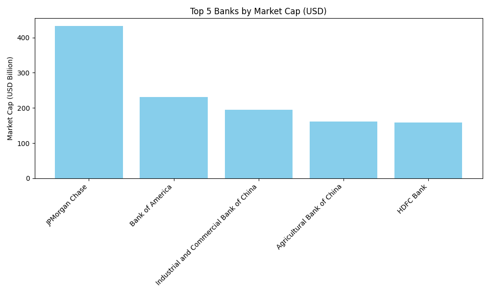

# BankScoop

**BankScoop** is a Python ETL (Extract, Transform, Load) project that scrapes the top global banks by market capitalization from Wikipedia (via Wayback Machine), converts the data into multiple currencies, stores it in a SQLite database, and visualizes the top 5 banks in a bar chart.

## 📁 Project Structure

```
BankScoop/
│
├── banks_project.py             # Main script
├── exchange_rate.csv            # Input file with exchange rates
├── data/
│   └── Largest_banks_data.csv   # Output: transformed CSV data
├── output/
│   └── top5_banks_chart.png     # Output: visualization chart
├── code_log.txt                 # Execution log
└── README.md                    # Project description and usage
```

## 🔧 Installation

To run the script:

1. **Clone the repository**

```bash
git clone https://github.com/yourusername/BankScoop.git
cd Bank_Scoop
```

2. **Install required packages**

```bash
pip install -r requirements.txt
```

Or manually:

```bash
pip install beautifulsoup4 requests pandas numpy matplotlib tabulate
```

> 💡 Tip: You can use a virtual environment:

```bash
python3 -m venv venv
source venv/bin/activate  # For Unix/macOS
venv\Scripts\activate     # For Windows
```

## 🚀 How to Run

```bash
python3 banks_project.py
```

This will:

* Scrape data from Wikipedia
* Apply exchange rates
* Save CSV to `/data`
* Insert into SQLite database
* Display and save visualization to `/output`

## ✅ Expected Output

The script logs the progress and prints a clean table like this:

```
📋 Top 10 Banks (Formatted Table):

╒═════════════════════════════════════════╤══════════════════╤══════════════════╤══════════════════╤══════════════════╕
│ Name                                    │   MC_USD_Billion │   MC_GBP_Billion │   MC_EUR_Billion │   MC_INR_Billion │
╞═════════════════════════════════════════╪══════════════════╪══════════════════╪══════════════════╪══════════════════╡
│ JPMorgan Chase                          │           432.92 │           346.34 │           402.62 │          35910.7 │
│ Bank of America                         │           231.52 │           185.22 │           215.31 │          19204.6 │
│ ...                                     │              ... │              ... │              ... │              ... │
╘═════════════════════════════════════════╧══════════════════╧══════════════════╧══════════════════╧══════════════════╛
```

It also saves a chart to `output/top5_banks_chart.png` like this:

📊 **Top 5 Banks by Market Cap (USD)**



And shows terminal logs and query results like the following:

📸 **Formatted Table Screenshot**


📸 **SQL and Log Output**


## 🧠 Skills Highlighted

* Python Web Scraping (BeautifulSoup)
* Data Transformation with Pandas & NumPy
* ETL Workflow Design
* SQLite Database Interaction
* Data Visualization with Matplotlib
* CLI Logging and Clean Output Formatting (tabulate)

## 📄 License

This project is open-source and free to use under the MIT License.

---

Feel free to fork this repo or suggest improvements!
